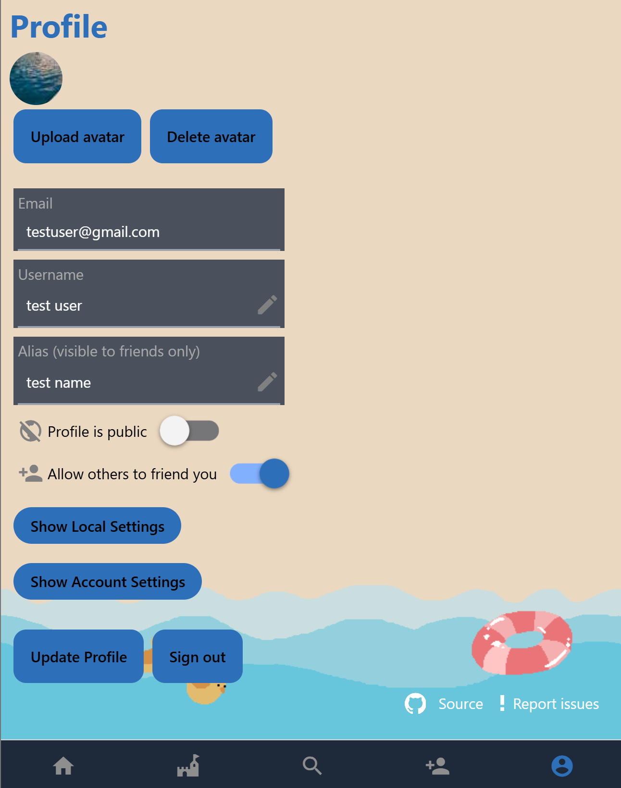

# Bucket List App

[](#)

[](https://github.com/ollime/bucket-list-app/releases)



An app to keep track of and share bucket list items with friends.

- Mobile app built with React Native + Expo, backend with Supabase
- Create an account by signing up with email
- Add your friends to track you activities together
- Add bucket list activities and check them off as you complete them
- Generates sandcastle images with 7 variants based on how many activities the user completes
- Stores app settings locally using Async Storage

## Downloads

Download the .apk package or visit the web deployment from the [latest release](https://github.com/ollime/bucket-list-app/releases)

## Local development build

To download the source code: ```git clone https://github.com/ollime/bucket-list-app.git```

To install packages required by the project: ```npm install```

Set up the `.env` file in the root directory with EXPO_PUBLIC_SUPABASE_URL, EXPO_PUBLIC_SUPABASE_ANON_KEY, EXPO_PUBLIC_SUPABASE_ID

### Web
To run the app in web: `npm run web`

### Android
If `expo-dev-client` is installed,

- To run the prebuild: `npm run prebuild`
- Make sure the sdk location is specified in android/local.properties
  - `sdk.dir=YOUR_FILE_DIRECTORY_HERE`
- Add in the following config options in build.gradle:
  ```
  buildscript {
    ext {
          minSdkVersion = 24
          compileSdkVersion = 35
          targetSdkVersion = 35
      }
  }
  android {
    defaultConfig {
      minSdkVersion = 24
      compileSdkVersion = 35
      targetSdkVersion = 35
    },
  ndkVersion = "25.1.8937393"
  }
  ```
- To run the app: `npm run android`
- For more details, look up the Expo docs for wired debugging with Android

## Production build

If the local build is set up:

Set `NODE_ENV=production` in the `.env` file

Check `package.json` for the Android and web build commands
